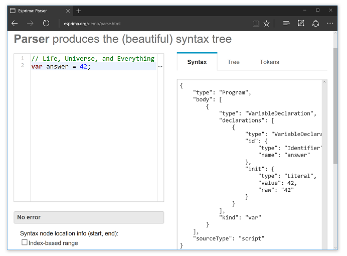

# Chapter 1. Getting Started

Esprima is a tool to perform lexical and syntactical analysis of JavaScript programs. Esprima itself is also written in JavaScript.

To get the feeling of what Esprima can do, please try its [online parser demo](http://esprima.org/demo/parse.html):



The left panel is a code editor, it can accept any JavaScript source. If the source is a valid JavaScript program, the right panel shows the [syntax tree](https://en.wikipedia.org/wiki/Abstract_syntax_tree) as the result of parsing that JavaScript program. The syntax tree can be displayed in its original form (JSON, but formatted) or in its visual form (hierarchical node view).

**Important**: Esprima can only process JavaScript programs. It does not handle other variations of JavaScript such as [Flow](https://flow.org/), [TypeScript](http://www.typescriptlang.org/), etc.

## Supported environments

Since Esprima is written in JavaScript, it can run on various JavaScript environments, including (but not limited to):

* Modern web browsers (the latest version of Edge, Firefox, Chrome, Safari, etc)
* Legacy web browsers (Internet Explorer 10 or later)
* [Node.js](https://nodejs.org/en/) v4 or later
* JavaScript engine in Java, such as [Rhino](https://developer.mozilla.org/en-US/docs/Mozilla/Projects/Rhino) and [Nashorn](https://docs.oracle.com/javase/8/docs/technotes/guides/scripting/nashorn/)

## Using Node.js to play with Esprima

To quickly experiment with Esprima, it is recommended to use Node.js and its interactive [REPL](https://en.wikipedia.org/wiki/REPL).

First, install [Node.js](https://nodejs.org/en/) v4 or later (including its package manager, [npm](https://docs.npmjs.com/)). Then, from the command-line or the terminal, install Esprima npm module:

```
$ npm install esprima
```

To verify that the module is available, use `npm ls`:

```
$ npm ls
/home/ariya/demo
└── esprima@4.0.0
```

The number after the `@` symbol, `4.0.0`, indicates the version of [Esprima package](https://www.npmjs.com/package/esprima) downloaded and installed from the package registry. This may vary from time to time, depending on the latest stable version available for everyone.

To play with Esprima within Node.js, first launch Node.js. Inside its [REPL](https://en.wikipedia.org/wiki/REPL) command prompt, load the module using `require` and then use it, as illustrated in the following session:

```js
$ node
> var esprima = require('esprima')
undefined
> esprima.parseScript('answer = 42')
Script {
  type: 'Program',
  body: [ ExpressionStatement { type: 'ExpressionStatement', expression: [Object] } ],
  sourceType: 'script' }
```

In the above example, the `parse` function of Esprima is invoked with a string containing a simple JavaScript program. The output is an object (printed by Node.js REPL) that is the representation of the program (an assignment expression). This object follows the format described in details in [Appendix A. Syntax Tree Format](syntax-tree-format.html).

If the source given to Esprima parser is not a valid JavaScript program, an exception will be thrown instead. The following example demonstrates that:

```js
$ node
> var esprima = require('esprima')
undefined
> esprima.parseScript('1+')
Error: Line 1: Unexpected end of input
```

To use Esprima in a library or an application designed to be used with Node.js, include `esprima` as a dependency in the `package.json` manifest.

## Using Esprima in a web browser

To use Esprima in a browser environment, it needs to be loaded using the `script` element. For instance, to load Esprima from a CDN such as [unpkg](https://unpkg.com/), the HTML document needs to have the following line:

```html
<script src="https://unpkg.com/esprima@~4.0/dist/esprima.js"></script>
```

When  Esprima is loaded this way, it will be available as a global object named `esprima`.

Since Esprima supports [AMD](https://github.com/amdjs/amdjs-api/wiki/AMD) (Asynchronous Module Definition), it can be loaded with a module loader such as [RequireJS](http://requirejs.org/):

```js
require(['esprima'], function (parser) {
    // Do something with parser, e.g.
    var syntax = parser.parse('var answer = 42');
    console.log(JSON.stringify(syntax, null, 4));
});
```

## Using Esprima with Rhino or Nashorn

With [Rhino](https://developer.mozilla.org/en-US/docs/Mozilla/Projects/Rhino) or [Nashorn](https://docs.oracle.com/javase/8/docs/technotes/guides/scripting/nashorn/), Esprima must be loaded from its source using the `load` function, such as:

```js
load('/path/to/esprima.js');
```

The module `esprima` will be available as part of the global object.

The following session with Nashorn shell, [jrunscript](https://docs.oracle.com/javase/8/docs/technotes/tools/windows/jrunscript.html), demonstrates the usage:

```js
$ jrunscript
nashorn> load('esprima.js')
nashorn> ast = esprima.parseScript('const answer = 42')
[object Object]
nashorn> print(JSON.stringify(ast, null, 2))
{
  "type": "Program",
  "body": [
    {
      "type": "VariableDeclaration",
      "declarations": [
        {
          "type": "VariableDeclarator",
          "id": {
            "type": "Identifier",
            "name": "answer"
          },
          "init": {
            "type": "Literal",
            "value": 42,
            "raw": "42"
          }
        }
      ],
      "kind": "const"
    }
  ],
  "sourceType": "script"
}
```
