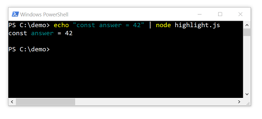

# Chapter 3. Lexical Analysis (Tokenization)

Esprima tokenizer takes a string as an input and produces an array of tokens, a list of object representing categorized input characters.
This is known as _[lexical analysis](https://en.wikipedia.org/wiki/Lexical_analysis)_.

The interface of the `tokenize` function is as follows:

```js
esprima.tokenize(input, config)
```

where

* `input` is a string representing the program to be tokenized
* `config` is an object used to customize the parsing behavior (optional)

The `input` argument is mandatory. Its type must be a string, otherwise the tokenization behavior is not determined.

The description of various properties of `config` is summarized in the following table:

<table>
<tr><th>Name</th> <th>Type</th> <th>Default</th> <th>Description</th></tr>
<tr><td>range</td> <td>Boolean</td> <td>false</td> <td>Annotate each token with its zero-based start and end location</td></tr>
<tr><td>loc</td> <td>Boolean</td> <td>false</td> <td>Annotate each token with its column and row-based location</td></tr>
<tr><td>comment</td> <td>Boolean</td> <td>false</td> <td>Include every line and block comment in the output</td></tr>
</table>

An example Node.js REPL session that demonstrates the use of Esprima tokenizer is:

```js
$ node
> var esprima = require('esprima')
> esprima.tokenize('answer = 42')
[ { type: 'Identifier', value: 'answer' },
  { type: 'Punctuator', value: '=' },
  { type: 'Numeric', value: '42' } ]
```

In the above example, the input string is tokenized into 3 tokens: an identifier, a punctuator, and a number. For each token, the `type` property is a string indicating the type of the token and the `value` property stores the corresponding the _lexeme_, i.e. a string of characters which forms a syntactic unit.

Unlike the `parse` function, the `tokenize` function can work with an input string that does not represent a valid JavaScript program. This is because lexical analysis, as the name implies, does _not_ involve the process of understanding the syntactic structure of the input.

```js
$ node
> var esprima = require('esprima')
> esprima.tokenize('42 = answer')
[ { type: 'Numeric', value: '42' },
  { type: 'Punctuator', value: '=' },
  { type: 'Identifier', value: 'answer' } ]
> esprima.tokenize('while (if {}')
[ { type: 'Keyword', value: 'while' },
  { type: 'Punctuator', value: '(' },
  { type: 'Keyword', value: 'if' },
  { type: 'Punctuator', value: '{' },
  { type: 'Punctuator', value: '}' } ]
```

## Token Location

By default, each token in the array returned by the tokenizer only has two properties, the _type_ of the token and the _lexeme_. For some use cases, the location of each token needs to be known as well (e.g. to offer a meaningful feedback to the user). Esprima tokenizer can add that location information to each token in two forms, zero-based range and line-column location. This is done by customizing the tokenization process with the configuration object.

Setting `range` (in the configuration object) to true adds a new property, `range`, to each token. It is an array of two elements, each indicating the zero-based index of the _starting_ and _end_ location (exclusive) of the token. A simple example follows:

```js
$ node
> var esprima = require('esprima')
> esprima.tokenize('answer = 42', { range: true })
[ { type: 'Identifier', value: 'answer', range: [ 0, 6 ] },
  { type: 'Punctuator', value: '=', range: [ 7, 8 ] },
  { type: 'Numeric', value: '42', range: [ 9, 11 ] } ]
```

In the above example, the starting and end location of each token can be determined from its range property. For instance, the equal sign (`=`) is the 7th character in the input string, because its range is `[7, 8]`.

Setting `loc` to true adds a new property, `loc`, to each token. It is a object that contains the _line number_ and _column number_ of the starting and end location (exclusive) of the token. This is illustrated in the example:

```js
$ node
> var esprima = require('esprima')
> tokens = esprima.tokenize('answer = 42', { loc: true });
> tokens[2]
{ type: 'Numeric',
  value: '42',
  loc: { start: { line: 1, column: 9 }, end: { line: 1, column: 11 } } }
```

Note that the line number is _one-based_ while the column number is _zero-based_.

It is possible to set both `range` and `loc` to true, thereby giving each token the most complete location information.

## Line and Block Comments

By default, Esprima tokenizer ignores every line and block comment. If each comment needs to be included in the output, then the property `comment` in the configuration object needs to be set to true. To illustrate this, compare the following simple tokenization:

```js
$ node
> var esprima = require('esprima')
> esprima.tokenize('/* answer */ 42')
[ { type: 'Numeric', value: '42' } ]
```

with the following situation where the token array also contains the block comment:

```js
$ node
> var esprima = require('esprima')
> esprima.tokenize('/* answer */ 42', { comment: true })
[ { type: 'BlockComment', value: ' answer ' },
  { type: 'Numeric', value: '42' } ]
```

If the location of each comment is needed, enable the location information using `range` and/or `loc` (as explained in the previous section):

```js
$ node
> var esprima = require('esprima')
> esprima.tokenize('/* answer */ 42', { comment: true, range: true })
[ { type: 'BlockComment', value: ' answer ', range: [ 0, 12 ] },
  { type: 'Numeric', value: '42', range: [ 13, 15 ] } ]
```

## Limitation on Keywords

Since a tokenization process does not have the context of the syntactic structure, it is unable to infer properly that a particular reserved word is being used not as a keyword. Therefore, it always classifies a reserved word as keyword. A simple example to illustrate this limitation:

```js
$ node
> var esprima = require('esprima')
> esprima.tokenize('x.if = 1')
[ { type: 'Identifier', value: 'x' },
  { type: 'Punctuator', value: '.' },
  { type: 'Keyword', value: 'if' },
  { type: 'Punctuator', value: '=' },
  { type: 'Numeric', value: '1' } ]
```

In the above session, the type of the `if` token is `Keyword`.

This is however different than what will be obtained using Esprima parser since the parser correctly matches the `if` token as an object property and therefore constructs an associated `Identifier` node, not a `Keyword` node.

```js
$ node
> var esprima = require('esprima')
> esprima.parseScript('x.if = 1').body[0].expression.left.property
Identifier { type: 'Identifier', name: 'if' }
```

## Limitation on JSX

[JSX](http://facebook.github.io/jsx/) is a syntax extension to JavaScript, popularly known to build web applications using [React](https://facebook.github.io/react/). JSX is not part of any [official ECMAScript specification](http://www.ecma-international.org/publications/standards/Ecma-262.htm).

Esprima tokenizer is unable to process input source that contains a mix of JavaScript code and JSX. This is because switching to JSX mode requires an understanding of the context, which a tokenizer does not have. In particular, a closing JSX element (such as `</title>`) confuses the tokenizer since the forward slash (`/`) is identified as the start of a regular expression.

## Example: Syntax Highlighting

The following Node.js script demonstrates the use of Esprima tokenizer to apply [syntax highlighting](https://en.wikipedia.org/wiki/Syntax_highlighting) of JavaScript code fragment. It accepts the input from `stdin` and produces color coded version to `stdout` by using [ANSI escape code](https://en.wikipedia.org/wiki/ANSI_escape_code).

```js
const esprima = require('esprima');
const readline = require('readline');

const CYAN = '\x1b[36m';
const RESET = '\x1b[0m'
let source = '';

readline.createInterface({ input: process.stdin, terminal: false })
.on('line', line => { source += line + '\n' })
.on('close', () => {
    const tokens = esprima.tokenize(source, { range: true });
    const ids = tokens.filter(x => x.type === 'Identifier');
    const markers = ids.sort((a, b) => { return b.range[0] - a.range[0] });
    markers.forEach(t => {
        const id = CYAN + t.value + RESET;
        const start = t.range[0];
        const end = t.range[1];
        source = source.slice(0, start) + id + source.slice(end);
    });
    console.log(source);
});
```

An example run is shown in the following screenshot (the script is called `highlight.js`):



The script uses the [readline module](https://nodejs.org/api/readline.html) to read the input line-by-line, collecting each line to a local string buffer. Once there is no more input, it invokes Esprima tokenizer to break the source into a list of tokens. The script only cares about identifier tokens, hence the filtering. For each token, the starting location is used to determine where to insert the [escape code](https://en.wikipedia.org/wiki/ANSI_escape_code) to change the color to cyan and the end location is used to reset the color. This is done from the last identifier token to the first identifier token, which necessities the sorting in reverse order.

For a real-world syntax highlighter that has many more features, take a look at _cardinal_ (source repository: [github.com/thlorenz/cardinal](https://github.com/thlorenz/cardinal)). It uses a similar approach, i.e. using Esprima tokenizer to break the source into tokens and then wrap each token with a type-specific color.
