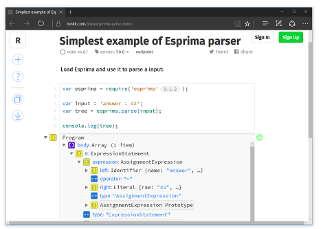
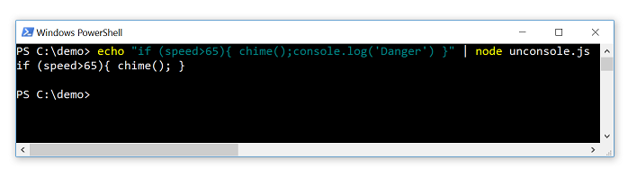
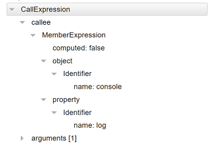

# Chapter 2. Syntactic Analysis (Parsing)

The main use case of Esprima is to parse a JavaScript program. This is also known as _[syntactic analysis](https://en.wikipedia.org/wiki/Parsing)_.

Esprima parser takes a string representing a valid JavaScript program and produces a [syntax tree](https://en.wikipedia.org/wiki/Abstract_syntax_tree), an ordered tree that describes the syntactic structure of the program. The resulting syntax tree is useful for various purposes, from [program transformation](https://en.wikipedia.org/wiki/Program_transformation) to [static program analysis](https://en.wikipedia.org/wiki/Static_program_analysis).

The interface of the `parse` function is as follows:

```js
esprima.parse(input, config, delegate)
```

where

* `input` is the string representing the program to be parsed
* `config` is an object used to customize the parsing behavior (optional)
* `delegate` is a callback function invoked for every single node (optional)

The `input` argument is mandatory. Its type must be a string, otherwise the parsing behavior is not determined. The other two arguments, `config` and `delegate`, are optional.

The object returned by the `parse` function is the [syntax tree](https://en.wikipedia.org/wiki/Abstract_syntax_tree), following the format described in details in [Appendix A. Syntax Tree Format](syntax-tree-format.html).

The description of various parsing configuration is summarized in the following table:

<table border="1" cellpadding="8" cellspacing="8">
<tr><td>Name</td> <td>Type</td> <td>Default</td> <td>Description</td></tr>
<tr><td>sourceType</td> <td>String</td> <td>"script"</td> <td>Define the program type: a script or a module</td></tr>
<tr><td>jsx</td> <td>Boolean</td> <td>false</td> <td>Support JSX syntax</td></tr>
<tr><td>range</td> <td>Boolean</td> <td>false</td> <td>Annotate each node with its index-based location</td></tr>
<tr><td>loc</td> <td>Boolean</td> <td>false</td> <td>Annotate each node with its column and row-based location</td></tr>
<tr><td>tolerant</td> <td>Boolean</td> <td>false</td> <td>Tolerate a few cases of syntax errors</td></tr>
<tr><td>token</td> <td>Boolean</td> <td>false</td> <td>Collect every token</td></tr>
<tr><td>comments</td> <td>Boolean</td> <td>false</td> <td>Collect every line and block comment</td></tr>
</table>



The previous chapter, [Getting Started](getting-started.html), already demonstrates the simplest possible example of using Esprima parser. To use it as the basis for further experiments, use Runkit and tweak the existing demo notebook: [runkit.com/ariya/esprima-parse-demo](https://runkit.com/ariya/esprima-parse-demo).

## Distinguishing a Script and a Module

With ES2015 and later, a JavaScript program can be either [a script or a module](http://www.ecma-international.org/ecma-262/6.0/index.html#sec-ecmascript-language-scripts-and-modules). It is a very important distinction, a parser such as Esprima needs to know the type of the source to be able to analyze its syntax correctly. This is achieved by specifying the `sourceType` property in the configuration object. The default value is `"script"`, i.e. the program will be treated as a script and not a module. Another possible value is `"module"`, which instructs the parser to treat the program as a module.

An example of parsing a script:

```js
$ node
> var esprima = require('esprima')
> esprima.parse('answer = 42', { sourceType: 'script' });
Program {
  type: 'Program',
  body: [ ExpressionStatement { type: 'ExpressionStatement', expression: [Object] } ],
  sourceType: 'script' }
```

An example of parsing a module:

```js
$ node
> var esprima = require('esprima')
> esprima.parse('import { sqrt } from "math.js"', { sourceType: 'module' });
Program {
  type: 'Program',
  body:
   [ ImportDeclaration {
       type: 'ImportDeclaration',
       specifiers: [Object],
       source: [Object] } ],
  sourceType: 'module' }
```

Failing to specify the source type can lead to a _mistaken_ observation that Esprima does not support a certain syntax. Take a look at this example:

```js
$ node
> var esprima = require('esprima')
> esprima.parse('export const answer = 42');
Error: Line 1: Unexpected token
```

Instead of producing the syntax tree, the parser throws an exception. This is the correct behavior, an `export` statement can only be part of a module, not a script. Thus, the parser properly determines that such a source program (treated as a script since `sourceType` is not specified) is invalid.

## JSX Syntax Support

[JSX](http://facebook.github.io/jsx/) is a syntax extension to JavaScript, popularly known to build web applications using [React](https://facebook.github.io/react/). JSX is not part of any [official ECMAScript specification](http://www.ecma-international.org/publications/standards/Ecma-262.htm). Application code using JSX is typically preprocessed first into standard JavaScript.

Esprima parser fully understands JSX syntax when `jsx` flag in the parsing configuration object is set to true, as illustrated in the following example:

```js
$ node
> var esprima = require('esprima')
> esprima.parse('var el= <title>${product}</title>', { jsx: true });
Program {
  type: 'Program',
  body:
   [ VariableDeclaration {
       type: 'VariableDeclaration',
       declarations: [Object],
       kind: 'var' } ],
  sourceType: 'script' }
```

## Browser Compatibility

In a certain specific case, Esprima parser _intentionally_ does not throw an exception (indicating a syntax error) although the input being parsed is not valid. This is to achieve an implementation compatibility with major web browsers. For further details, refer to the official [ECMAScript 2015 Language Specification](http://www.ecma-international.org/publications/standards/Ecma-262.htm), Section B.3.3 on **Block-Level Function Declarations Web Legacy Compatibility Semantics**:

> Prior to ECMAScript 2015, the ECMAScript specification did not define the occurrence of a _FunctionDeclaration_ as an element of a _Block_ statement's _StatementList_. However, support for that form of _FunctionDeclaration_ was an allowable extension and most browser-hosted ECMAScript implementations permitted them.

This is illustrated in the following example:
```js
$ node
> var esprima = require('esprima')
> esprima.parse('if (x) function y() {}')
Program {
  type: 'Program',
  body:
   [ IfStatement {
       type: 'IfStatement',
       test: [Object],
       consequent: [Object],
       alternate: null } ],
  sourceType: 'script' }
```

In the above example, Esprima parser returns a syntax tree for the code (it does not throw an exception) even though the input is invalid according to the specification, i.e. declaring a function inside the block of an If statement is not possible. In this case, the behavior of Esprima is the same as the popular web browsers such as Firefox, Chrome, Safari, and many others.

## Tolerant Mode

When Esprima parser is given an input that does not represent a valid JavaScript program, it throws an exception. With the tolerant mode however, the parser _may_ choose to continue parsing and produce a syntax tree. This is best demonstrated with an example.

Consider the following parsing session. The exception is expected, since a `with` statement is not permitted in strict mode.

```js
$ node
> var esprima = require('esprima')
> esprima.parse('"use strict"; with (x) {}')
Error: Line 1: Strict mode code may not include a with statement
```

If the tolerant mode is activated by setting the `tolerant` flag to true in the parsing configuration, the parser behaves differently:

```js
$ node
> var esprima = require('esprima')
> esprima.parse('"use strict"; with (x) {}', { tolerant: true })
Program {
  type: 'Program',
  body:
   [ Directive {
       type: 'ExpressionStatement',
       expression: [Object],
       directive: 'use strict' },
     WithStatement { type: 'WithStatement', object: [Object], body: [Object] } ],
  sourceType: 'script',
  errors:
   [ { Error: Line 1: Strict mode code may not include a with statement
       index: 13,
       lineNumber: 1,
       description: 'Strict mode code may not include a with statement' } ] }
```

In the above case, the parser does not throw an exception and it still returns a syntax tree. However, it also adds a new array named `errors`, it contains each and every syntax error that the parser manages to tolerate without causing it to stop right away. Each entry in the `errors` has the detailed information regarding the error, including the description and the location.

Note that the tolerant mode is intended to deal with very few types of syntax errors. It is unable to robustly handle every possible invalid program.

## Node Location

By default, Esprima parser produces an [abstract syntax tree](https://en.wikipedia.org/wiki/Abstract_syntax_tree). For some uses cases, this abstract syntax tree is not sufficient. For instance, having the location information of each node is necessary in a few cases of static analysis, e.g. to give a meaningful feedback to the user.

To have each node carries some additional properties indicating its location, the parser must be invoked by specifying the flags, `range` or `loc` or both of them, in the parsing configuration.

Setting the `range` flag to true adds a new property, `range`, to each node. It is an array of two elements, each indicating the zero-based index of the starting and end location (exclusive) of the node. A simple example follows:

```js
$ node
> var esprima = require('esprima')
> esprima.parse('answer = 42', { range: true })
Program {
  type: 'Program',
  body:
   [ ExpressionStatement {
       type: 'ExpressionStatement',
       expression: [Object],
       range: [Object] } ],
  sourceType: 'script',
  range: [ 0, 11 ] }
```

The top-level _Program_ node has the range [0, 11]. This indicates that the program starts from the zeroth character and finishes before the 11th character.

A subsequent example to inspect the numeric literal 42 on the right side of the assignment:

```js
$ node
> var esprima = require('esprima')
> var program = esprima.parse('answer = 42', { range: true })
> program.body[0].expression.right
Literal { type: 'Literal', value: 42, raw: '42', range: [ 9, 11 ] }
```

In the above example, the location of the _Literal_ node is determined to be [9, 11]. In other words, the ninth and the tenth characters (the eleventh is excluded) of the source correspond to the numeric literal `42`.

Setting the `loc` flag to true adds a new property, `loc`, to each node. It is a object that contains the line number and column number of the starting and end location (exclusive) of the node. It is illustrated in this example:

```js
$ node
> var esprima = require('esprima')
> esprima.parse('answer = 42', { loc: true })
Program {
  type: 'Program',
  body:
   [ ExpressionStatement {
       type: 'ExpressionStatement',
       expression: [Object],
       loc: [Object] } ],
  sourceType: 'script',
  loc: { start: { line: 1, column: 0 }, end: { line: 1, column: 11 } } }
```

Note that the line number is _one-based_ while the column number is _zero-based_.

It is possible to set both `range` and `loc` to true, thereby giving each token the most complete location information.

## Handling Hashbang/Shebang

In a Unix environment, a shell script often has its first line marked by a hashbang or a shebang, `#!`. A common example is a utility intended to be executed by Node.js, which may look like the following:

```js
#!/usr/bin/env node
console.log('Hello from Node.js!');
```

If Esprima parser is being used to process the content of the above file, the parser will throw an exception. This is because that hashbang is not valid in JavaScript. A quick Node.js REPL session to illustrate the point:

```js
$ node
> var esprima = require('esprima')
> var src = ['#!/usr/bin/env node', 'answer = 42'].join('\n')
> esprima.parse(src)
Error: Line 1: Unexpected token ILLEGAL
```

The workaround for this problem is to remove the first line completely before passing it to the parser. One way to do that is to use a regular expression, as shown below:

```js
$ node
> var esprima = require('esprima')
> var src = ['#!/usr/bin/env node', 'answer = 42'].join('\n')
> src = src.replace(/^#!(.*\n)/, '')
'answer = 42'
> esprima.parse(src)
Program {
  type: 'Program',
  body: [ ExpressionStatement { type: 'ExpressionStatement', expression: [Object] } ],
  sourceType: 'script' }
```

Note that the above approach will shorten the source string. If the string length needs to be preserved, e.g. to facilitate an exact location mapping to the original version, then a series of whitespaces need to be padded to the beginning. A modified approach looks like the following:

```js
$ node
> var esprima = require('esprima')
> var src = ['#!/usr/bin/env node', 'answer = 42'].join('\n')
> src = src.replace(/(^#!.*)/, function(m) { return Array(m.length + 1).join(' ') });
> esprima.parse(src, { range: true })
Program {
  type: 'Program',
  body:
   [ ExpressionStatement {
       type: 'ExpressionStatement',
       expression: [Object],
       range: [Object] } ],
  sourceType: 'script',
  range: [ 15, 26 ] }
```

## Token Collection

When Esprima parser is performing the syntactical analysis, first it needs to break down the source into a series of tokens. By default, the tokens are not stored as part of the parsing result. It is possible to keep the tokens found during the parsing by setting the `tokens` flag in the configuration object to true. Take a look at this example:

```js
$ node
> var esprima = require('esprima')
> esprima.parse('const answer = 42', { tokens: true })
Program {
  type: 'Program',
  body:
   [ VariableDeclaration {
       type: 'VariableDeclaration',
       declarations: [Object],
       kind: 'const' } ],
  sourceType: 'script',
  tokens:
   [ { type: 'Keyword', value: 'const' },
     { type: 'Identifier', value: 'answer' },
     { type: 'Punctuator', value: '=' },
     { type: 'Numeric', value: '42' } ] }
```
The output of the parser now contains an additional property, an array named `tokens`. Every element in this array is the token found during the parsing process. For each token, the `type` property is a string indicating the type of the token and the `value` property stores the corresponding the _lexeme_, i.e. a string of characters which forms a syntactic unit.

The token also contains its location, if the parsing configuration has the flag `range` or `loc` (or both), as shown in the following example:

```js
$ node
> var esprima = require('esprima')
> var output = esprima.parse('const answer = 42', { tokens: true, range: true })
> output.tokens
[ { type: 'Keyword', value: 'const', range: [ 0, 5 ] },
  { type: 'Identifier', value: 'answer', range: [ 6, 12 ] },
  { type: 'Punctuator', value: '=', range: [ 13, 14 ] },
  { type: 'Numeric', value: '42', range: [ 15, 17 ] } ]
```

To tokenize a program without parsing it at all, refer to [Chapter 3. Lexical Analysis (Tokenization)](syntactic-analysis.html).

## Comment Collection

Comments do not affect the syntax of a JavaScript program and therefore they are ignored by Esprima parser. However, if it is important to collect every single-line and multi-line comment in the program, Esprima parser can be instructed to collect them by setting the `comment` flag in the parsing configuration to true.

Consider the following example. The output of the parser has an additional property, an array named `comments`. Every element in this array indicates a single-line or a mult-line comment encountered during the parsing process.

```js
$ node
> var esprima = require('esprima')
> esprima.parse('answer = 42 // TODO: why', { comment: true })
Program {
  type: 'Program',
  body: [ ExpressionStatement { type: 'ExpressionStatement', expression: [Object] } ],
  sourceType: 'script',
  comments: [ { type: 'Line', value: ' TODO: why' } ] }
```
The type of each comment can either be _Line_ for a single-line comment (`//` towards the end-of-line) or _Block_ for a multi-line comment (enclosed by `/*` and `*/`).

```js
$ node
> var esprima = require('esprima')
> esprima.parse('/*everything*/ answer = 42', { comment: true })
Program {
  type: 'Program',
  body: [ ExpressionStatement { type: 'ExpressionStatement', expression: [Object] } ],
  sourceType: 'script',
  comments: [ { type: 'Block', value: 'everything' } ] }
```

Each comment can also contain its location, if the parsing configuration has the flag `range` or `loc` (or both), illustrated here:

```js
$ node
> var esprima = require('esprima')
> output = esprima.parse('answer = 42 // TODO: why', { comment: true, range: true });
> output.comments
[ { type: 'Line', value: ' TODO: why', range: [ 12, 24 ] } ]
```

## Syntax Delegate

The last argument in the `parse` function is a delegate, a callback function invoked for each syntax node (as the node is constructed) with two arguments, the node object itself and the node metadata. The metadata contains the start and end location of the node.

The shortest Node.js script that illustrates the delegate is the following:
```js
var esprima = require('esprima');
esprima.parse('answer = 42', {}, function (node) {
    console.log(node.type);
});
```

If the script is called `delegate.js`, running it with Node.js gives the output:
```js
$ node delegate.js
Identifier
Literal
AssignmentExpression
ExpressionStatement
Program
```

In the above example, the callback function only does one simple thing: printing the type of the node. The first two calls are with the deepest nodes (which are also leaves), an _Identifier_ node representing `answer` and a _Literal_ node for `42`. The next is with an _AssignmentExpression_ node that combines the previous two nodes (`answer = 42`). It is then followed by the only statement in the code fragment, an _ExpressionStatement_ node. The last one, as with every syntax tree, is always the top-level _Program_ node.

The order of the nodes being passed as the argument for the callback function resembles a tree traversal using the [depth-first algorithm](https://en.wikipedia.org/wiki/Depth-first_search).

If each single-line and multi-line comment must be passed to the callback function as well, the `comment` flag in the parsing configuration needs to be true. A modified `delegate.js` and its new result (note the addition of _LineComment_ node type):

```js
$ cat delegate.js
var esprima = require('esprima');
esprima.parse('answer = 42 // FIXME', { comment: true }, function (node) {
    console.log(node.type);
});

$ node delegate.js
Identifier
LineComment
Literal
AssignmentExpression
ExpressionStatement
Program
```

The second argument passed to the callback function, the metadata, can be used to locate the node. It is illustrated in the following example:

```js
$ cat delegate.js
var esprima = require('esprima');
esprima.parse('answer = 42', {}, function (node, metadata) {
    console.log(node.type, metadata);
});

$ node delegate.js
Identifier { start: { line: 1, column: 0, offset: 0 },
  end: { line: 1, column: 6, offset: 6 } }
Literal { start: { line: 1, column: 9, offset: 9 },
  end: { line: 1, column: 11, offset: 11 } }
AssignmentExpression { start: { line: 1, column: 0, offset: 0 },
  end: { line: 1, column: 11, offset: 11 } }
ExpressionStatement { start: { line: 1, column: 0, offset: 0 },
  end: { line: 1, column: 11, offset: 11 } }
Program { start: { line: 1, column: 0, offset: 0 },
  end: { line: 1, column: 11, offset: 11 } }
```

## Example: console Calls Removal

The following Node.js script demonstrates the use of Esprima parser to remove every single expression that represents a `console` call. The script accepts the input from `stdin` and displays the result to `stdout`. The entire script comprises approximately 30 lines of code.

```js
const esprima = require('esprima');
const readline = require('readline');

// console.log(x) or console['error'](y)
function isConsoleCall(node) {
    return (node.type === 'CallExpression') &&
        (node.callee.type === 'MemberExpression') &&
        (node.callee.object.type === 'Identifier') &&
        (node.callee.object.name === 'console');
}

function removeCalls(source) {
    const entries = [];
    esprima.parse(source, {}, function (node, meta) {
        if (isConsoleCall(node)) {
            entries.push({
                start: meta.start.offset,
                end: meta.end.offset
            });
        }
    });
    entries.sort((a, b) => { return b.end - a.end }).forEach(n => {
        source = source.slice(0, n.start) + source.slice(n.end);
    });
    return source;
}

let source = '';
readline.createInterface({ input: process.stdin, terminal: false })
.on('line', line => { source += line + '\n' })
.on('close', () => { console.log(removeCalls(source)) });
```

An example run is shown in the following screenshot (the script is called `unconsole.js`). Note that the single call to `console.log` is eliminated in the output.



The script uses the [readline module](https://nodejs.org/api/readline.html) to read the input line-by-line, collecting each line to a buffer. Once there is no more input, it uses Esprima parser and utilizes the syntax delegate feature with a callback function that looks for a particular type of syntax node, i.e. a call expression with `console` object as the callee. The logic inside the `isConsoleCall` function is intended to match such a node. As an illustration, using the [Esprima online demo](http://esprima.org/demo/parse.html) to parse `console.log("Hello")` will reveal the following syntax tree:



For each matched node, the node location is recorded. Once the parsing is completed, the list of the location of every matched call expression with `console` is used to modify the source, i.e. the portion of the source corresponding to the call expression is removed. When it is done repeatedly, the result is that every single `console` call will disappear. Note how this is done from the last one to the first one (reflected by the sorting in the reverse order) to maintain the correct offset throughout the process.
